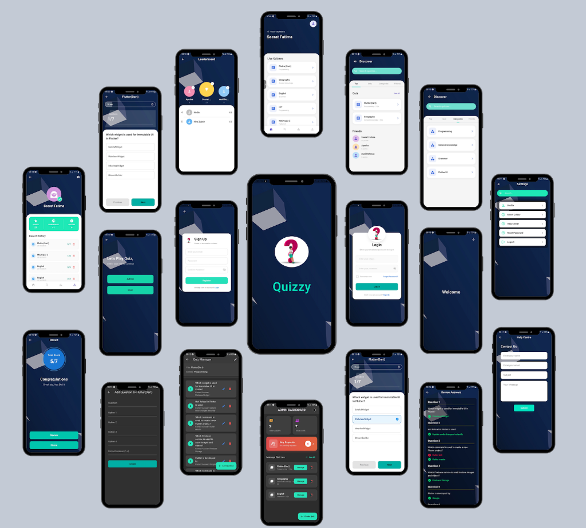

# Quizz App

A dynamic and interactive Quiz Application built with Flutter. This cross-platform mobile app allows users to participate in category-based quizzes, competitions, and track their performance on global leaderboards.

<p align="left">
  
  
  
</p>

## 🚀 Features

### For Users
*   **Authentication**: Secure Login, Signup, and Password Recovery.
*   **Discover Quizzes**: Browse quizzes by categories like Math, Science, History, and more.
*   **Real-time Leaderboard**: Compete with other users and see your global ranking.
*   **Quiz Interface**: Interactive quiz screens with progress indicators.
*   **Profile Management**: View quiz history, scores, and update profile details.

### For Admins
*   **Dashboard**: Overview of total users, active quizzes, and performance metrics.
*   **Content Management**: Create, update, and manage quizzes and questions.
*   **User Management**: View and manage registered users.
*   **Help Requests**: Respond to user help queries directly from the app.

## 🛠️ Tech Stack

*   **Framework**: [Flutter](https://flutter.dev/)
*   **Language**: Dart
*   **Backend**: Firebase (Auth, Firestore)
*   **State Management**: `setState` / Services pattern
*   **Assets**: Custom fonts and images

## 📦 Dependencies

*   `firebase_core`, `firebase_auth`, `cloud_firestore`: For backend services.
*   `cupertino_icons`: iOS style icons.
*   `app_links`: For deep linking capabilities.
*   `intl`: For internationalization and date formatting.

## 🏁 Getting Started

1.  **Clone the repository**:
    ```bash
    git clone https://github.com/Seeratfaatima/QuizzApp_.git
    ```

2.  **Install Dependencies**:
    ```bash
    flutter pub get
    ```

3.  **Firebase Setup**:
    *   This project uses Firebase. You will need your own `google-services.json` (Android) and `GoogleService-Info.plist` (iOS).
    *   Place them in `android/app/` and `ios/Runner/` respectively.

4.  **Run the App**:
    ```bash
    flutter run
    ```

## 📸 Screenshots



## 🤝 Contributing

Contributions are welcome! Please fork the repository and create a pull request.
